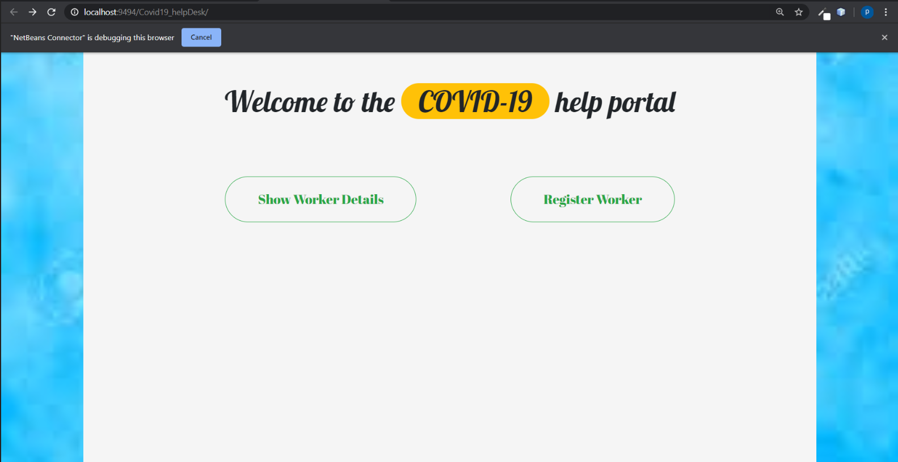

# CovidDataCollection

**Objective** : To Collect the data required for needy people in ongoing panademic COVID-19.

**Description** :
- This project is based on html , css , bootstrap , ajax , servlet .
- This project briefs the need of goverment . 

**Tools Used** : 
- NetBeans IDE
- MySQL database 
- Apache TOMCAT
- Browser

**Working** : 
- Welcome Page : 

-Registration Page : 
- Registration Page : 

- Registration Page (Successful Registration): 

- Registration Page (Unsuccessful Registration --> Re-entered Contact Number or Aadher No.): 

- Member Details : 

